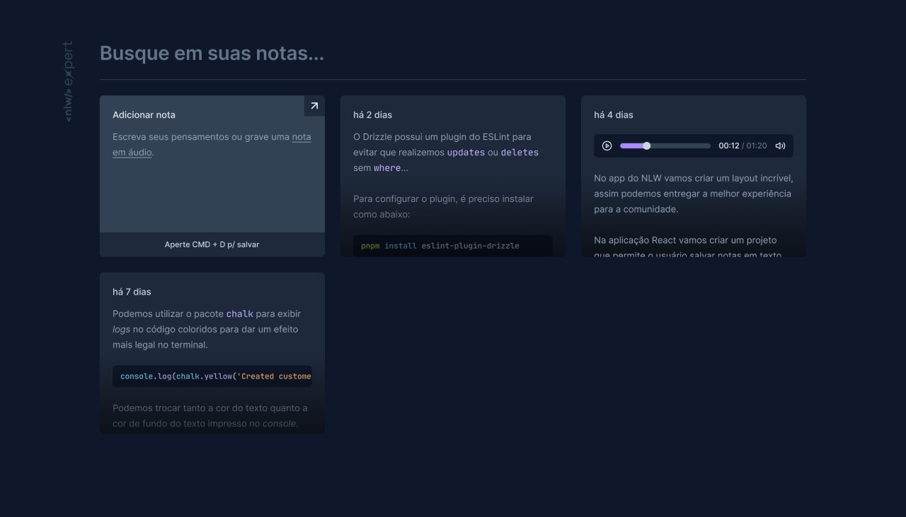

<p align="center">
  
  <a href="LICENSE"></a>
</p>

<div align="center">
  
</div>

<h1 align="center">🗒️ Notes</h1>

<p align="center">
  Uma ferramenta inovadora que permite você criar notas em texto ou gravando um áudio rapidamente, que são automaticamente convertidas em texto para referência fácil e rápida.
</p>

## Table of Contents

- [Table of Contents](#table-of-contents)
- [](#)
  - [Built With](#built-with)
- [Features](#features)
- [Getting Started](#getting-started)
  - [Prerequisites](#prerequisites)
  - [Installation](#installation)
- [Usage](#usage)
- [Roadmap](#roadmap)
- [Layout](#layout)
- [License](#license)
- [Contact](#contact)

## 

O Notes é uma aplicação intuitiva e eficiente que permita aos usuários salvar suas ideias e pensamentos através de notas de áudio ou de texto. As notas criadas podem ser localizadas no painel principal ou filtradas no campo de busca. além disso, o usuário pode excluir suas notas sempre que quiser.

Este projeto foi desenvolvido durante o NLW#14 (Next Level Week)#14 ministrado pela [Rocketseat](https://github.com/rocketseat).

### Built With

- [React](https://reactjs.org/)
- [TypeScript](https://www.typescriptlang.org/)
- [Tailwind CSS](https://tailwindcss.com/)
- [Radix UI](https://www.radix-ui.com/)
- [Sonner](https://sonner.emilkowal.ski/)
- [date-fns](https://date-fns.org/)
- [SpeechRecognition API](https://developer.mozilla.org/en-US/docs/Web/API/SpeechRecognition)

## Features

- Criar notas de áudio ou de texto.
- Listagem de todas as notas criadas.
- Transcrição automática de notas de áudio em texto.
- Acesso multiplataforma.

## Getting Started

Para começar a usar o `Notes` localmente, siga as instruções abaixo:

### Prerequisites

Você precisará ter o [Node.js](https://nodejs.org) instalado em seu sistema.

### Installation

1. Clone o repositório:

```bash
git clone https://github.com/rafael-camara/notes-nlw-expert.git
```

2. Navegue para o diretorio `notes-nlw-expert`

```bash
cd notes-nlw-expert
```

3. Execute o comando `npm install` ou `yarn install` para instalar os pacotes necessários.

```bash
npm install
yarn install
```

4. Execute o comando `npm run dev` para iniciar o servidor.

```bash
npm run dev
```

5. Abra o navegador e acesse `http://localhost:5173`.

## Usage

Após iniciar o servidor, você pode acessar o aplicativo em seu navegador e criar suas notas.

---
<p align="center">
  
</p>

## Roadmap

Recursos planejados para futuras versões:

- Adição de suporte para notas de áudio colaborativas.
- Implementação de recursos avançados de edição de texto nas transcrições.

## Layout

Nos links abaixo você encontra o layout do projeto web e também do mobile. Lembrando que você precisa ter uma conta no [Figma](http://figma.com/) para acessá-lo.

- [Layout](https://www.figma.com/community/file/1336456128647909148/nlw-expert-notes)

## License

Este projeto está licenciado sob a Licença MIT - veja o arquivo [LICENSE](LICENSE.md) para mais detalhes.

## Contact


- E-mail: [rafaelcamara.377@gmail.com](mailto:rafaelcamara.377@gmail.com)
- LinkedIn: [Rafael Câmara](https://www.linkedin.com/in/rafael-camara-573a9313b/)

---
Feito com ♥️ por [Rafael Câmara](https://github.com/rafael-camara)
